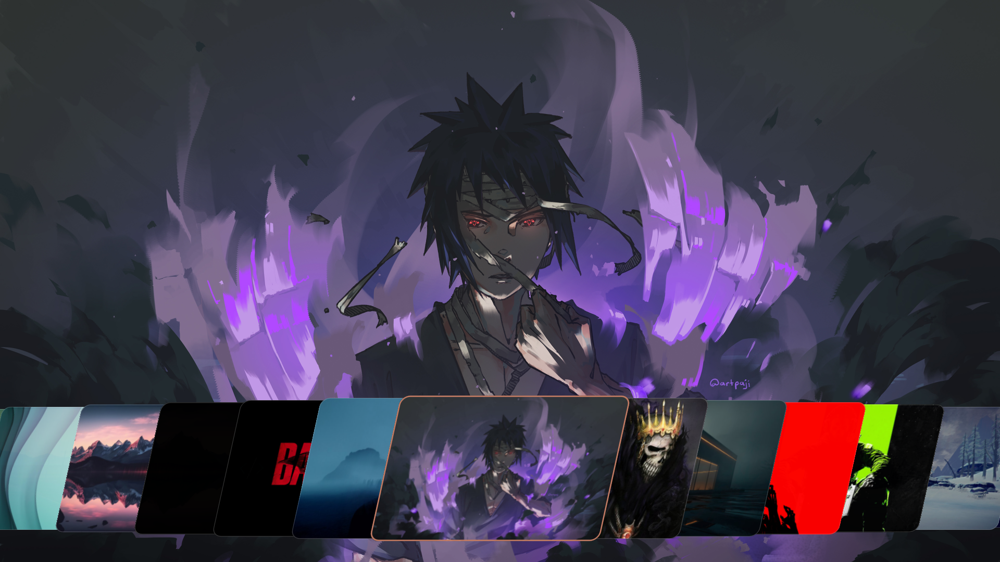
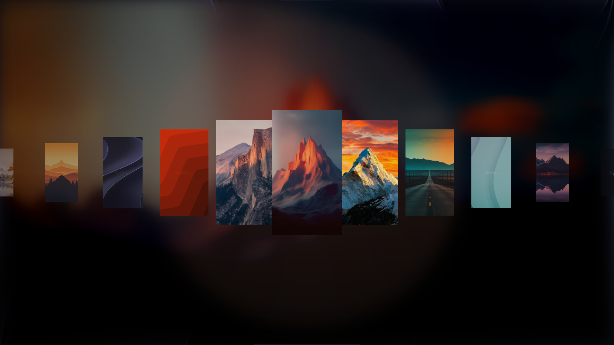
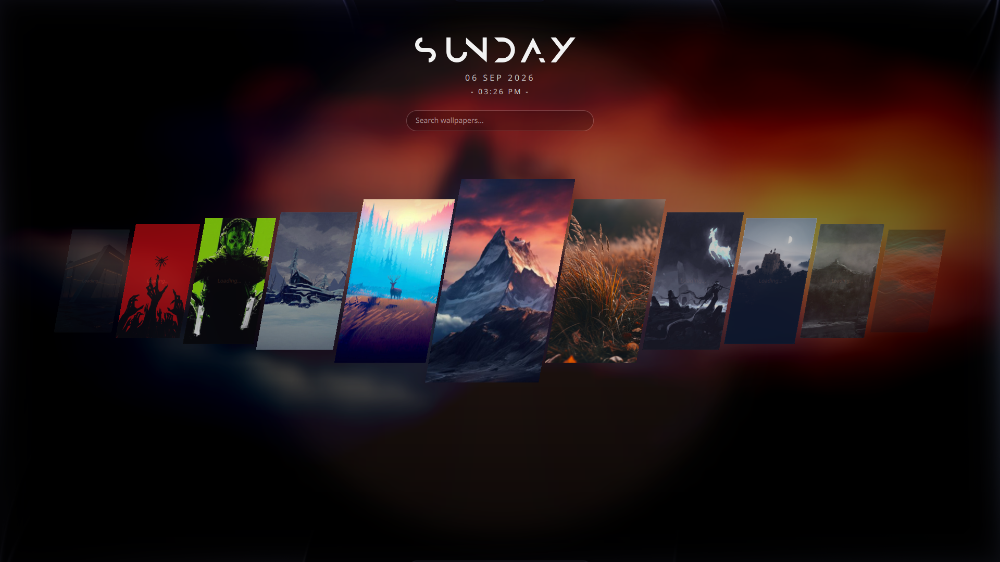
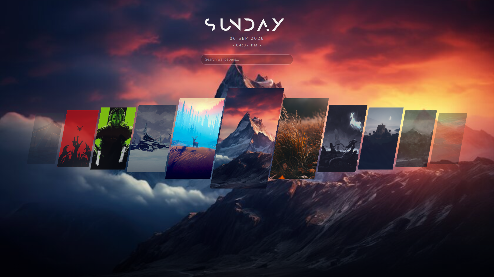
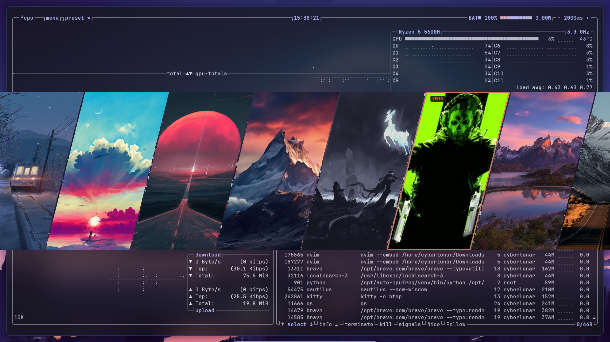

# 🖼️ HyprQuickPaper

A fast, themeable, keyboard-driven Wayland wallpaper picker built with **Quickshell** and **QML** for Hyprland (and any other `wlr-layer-shell` compositor). Pick a wallpaper with `h`/`l`, jump around with `u`/`d`, confirm with `Space`/`Enter`, bail with `Esc`.

Originally based on [iamsurjog/hyprquickpaper](https://github.com/iamsurjog/hyprquickpaper), itself inspired by [ilyamiro's dots](https://github.com/ilyamiro/nixos-configuration). This fork is rebuilt to run on **any** Wayland wallpaper backend, not just ML4W dotfiles.

> [!IMPORTANT]
> Out of the box this only needs **one** edit for most non-ML4W users: set `wallpaper_tool` in `config.json`. See [Configuration](#-configuration) below — everything else is optional tuning.

---

## 🧩 How it works: two separate pieces

This project is really two things working together, and it helps to know the difference before you touch `config.json`:

- **Quickshell** (via `shell.qml` / `shell-*.qml`) is the picker UI itself — the card deck, the animations, keyboard navigation, thumbnail rendering. It's what you actually see and interact with. Quickshell has no idea how to change your desktop background; that's not its job.
- **The wallpaper backend** (`swww`, `hyprpaper`, `swaybg`, `waypaper`, `feh`, or `ml4w`) is a separate program whose only job is: take an image path, paint it on screen. Once you press `Space`/`Enter` in the picker, `commands.sh` hands the chosen file off to whichever backend `wallpaper_tool` in `config.json` names.

So Quickshell is always used — no choice there, it's the engine this whole project runs on. `wallpaper_tool` is the one thing you pick based on what's actually installed on your system. See [Configuration](#-configuration) for which backend to choose.

---

## ✨ Features

- **Multiple layout modes** — Bottom Dock, Coverflow, Coverflow+Widgets, Classic list, and a no-blur widgets variant. Switch by editing one line in `shell.qml`.
- **Sheared bottom-dock deck** — parallelogram cards, rounded corners, uniform height, active-selection glow border.
- **Lossless full-quality background preview** — renders the actual full-resolution image behind the dock (not the downscaled thumbnail), crossfaded between picks.
- **Automatic thumbnail cache** — downscaled previews generated via ImageMagick so scrolling stays smooth with hundreds of wallpapers.
- **Live config reload** — `config.json` changes apply immediately, no restart needed.
- **Fully keyboard-driven** — no mouse required, though clicking works too.
- **Backend-agnostic** — works with swww, hyprpaper, waypaper, swaybg, or feh via a single config field, no bash editing required for common setups.
- **Embedded custom typography** — bundled display font, no manual install needed.

---

## 📸 Layouts

### Bottom Dock *(default)*
A sheared, parallelogram card deck along the bottom of the screen, uniform card height, with the focused card scaled up and outlined in your accent color.



### Coverflow
Cards fan out in 3D-style perspective around the focused item, classic "coverflow" browsing feel.



### Coverflow + Widgets
Same coverflow browsing, with extra on-screen widgets (clock/info) layered in.



### Widgets (No Blur)
Same widget layout as Coverflow+Widgets, with background blur disabled — use this if your compositor/GPU can't keep blur smooth.



### Classic List
A plain vertical/list layout — lightest on GPU, good for weaker hardware or minimal setups.



> Screenshots referenced above go under `assets/screenshots/` in this repo — add your own there.

---

## 📋 Dependencies

`install.sh` detects your package manager (pacman / dnf / apt) and installs all of these automatically, including the one that's easy to miss:

- [Quickshell](https://quickshell.org) (`qs` / `quickshell`) — renders the whole UI
- `jq` — parses `config.json`
- `imagemagick` (`convert`) — generates the thumbnail cache
- **Qt5Compat GraphicalEffects** QML module — powers the rounded-corner card masking; not bundled with base Qt
- A wallpaper backend of your choice: `swww`, `hyprpaper`, `waypaper`, `swaybg`, or `feh`

If your package manager isn't pacman/dnf/apt, or Quickshell isn't packaged for your distro yet, `install.sh` will print manual install pointers when it can't handle something itself — follow those rather than hunting for commands here.

**How to tell if Qt5Compat is the problem:** if the picker window opens but stays blank/transparent, or you see QML import errors mentioning `Qt5Compat` in your terminal when launching, that module is missing — re-run `install.sh` or install it manually per your distro's package name above.

---

## 🚀 Installation

```bash
git clone https://github.com/ujjalsigdel/hyprquickpaper.git ~/.config/hyprquickpaper
cd ~/.config/hyprquickpaper
chmod +x install.sh
./install.sh
```

Then launch with:
```bash
qs -p ~/.config/hyprquickpaper
```

Bind it to a Hyprland key so you don't retype that — add to `hyprland.conf` or `Keybindings.lua`:
```ini
bind = SUPER, W, exec, qs -p ~/.config/hyprquickpaper
```
or
```lua
hl.bind(
	mainMod .. " + CTRL + W",
	hl.dsp.exec_cmd("qs -p ~/.config/hyprquickpaper"),
	{ description = "Open HyprQuickPaper Wallpaper Picker" }
)
```

---

## ⚙️ Configuration

### `config.json`

```json
{
  "wallpaper_path": "~/Pictures/Wallpapers/",
  "cache_path": "~/.cache/quickshell/thumbs/",
  "wallpaper_tool": "hyprpaper",
  "number_of_pictures": 7,
  "border_color": "#C27B63",
  "cache_batch_size": 20
}
```

| Key | Meaning | What to set |
|---|---|---|
| `wallpaper_path` | Folder scanned for `.png`/`.jpg`/`.jpeg` files. | Your real wallpaper directory, **with a trailing `/`**, e.g. `"~/Wallpapers/"`. |
| `cache_path` | Where generated thumbnails live. Auto-created on first run. | Leave default, or point at tmpfs if you have thousands of wallpapers. |
| `wallpaper_tool` | **This is the one field almost everyone needs to change.** Selects which backend `commands.sh` uses. | One of `swww`, `hyprpaper`, `waypaper`, `swaybg`, `feh`, `ml4w`. |
| `number_of_pictures` | Jump distance for the `u`/`d` fast-scroll keys (not a display count). | Larger folder → bigger number (10–15+). |
| `border_color` | Hex color of the selected card's border. | Any hex, e.g. `"#89b4fa"`. |
| `cache_batch_size` | Max parallel `convert` jobs while building thumbnails. `0` = unlimited. | Set to roughly your CPU thread count (`4`–`16`) — don't leave at `0` with a large wallpaper folder. |

Changes apply live — no restart needed.

**Which `wallpaper_tool` should I actually pick?**

- **`hyprpaper` (default) — recommended for almost everyone.** It ships as part of the Hyprland project itself, so if you have Hyprland running at all, you already have access to it through the exact same channel (official repo, COPR, AUR, etc.) you used to install Hyprland. No separate third-party project to track.
- **`swaybg`** — simplest possible option, no animated transitions, but extremely stable and rarely breaks across distro updates. Good if you just want it to work.
- **`swww`** — nicest-looking transitions, but it's had real packaging turbulence recently: the upstream project was renamed/archived in late 2025 (now `awww`), which broke `swww`/`swww-daemon` on some distros' package resolution, and it has no official package on Fedora at all — `cargo install swww` there only installs the client half, not the daemon, and building from source can fail on very new Fedora releases due to unrelated build-tooling version gaps. It still works great once correctly installed, just budget some troubleshooting time, especially on Fedora.
- **`ml4w`** — only if you already have the full ML4W dotfiles installed; it's a thin wrapper around `hyprpaper` with ML4W-specific extras (effects, SDDM sync) layered on. If you don't already have ML4W, use `hyprpaper` directly instead.

### `commands.sh`

You shouldn't need to edit this at all for the six supported backends — just set `wallpaper_tool` above. It also writes the active wallpaper to `~/.cache/hyprquickpaper/current_wallpaper` after every pick, so the "highlight current wallpaper" feature works regardless of backend.

Only edit `commands.sh` directly if you need a backend that isn't in the preset list (e.g. `mpvpaper`, a custom script) — add a new `case` branch following the existing pattern.

> **Don't just copy `ml4w-wallpaper` from an ML4W install and point `commands.sh` at it.** That script also drives a hyprpaper template, ImageMagick wallpaper "effects", ML4W's own wallpaper-generated cache, and SDDM background sync — all tied to a full ML4W install. Outside of ML4W it will error out or silently no-op. Use the `swww`/`hyprpaper`/etc. presets above instead — they do the one job (set the wallpaper) with no hidden dependencies.

### `shell.qml` — which layout renders

```qml
property string activeLayout: "shell-bottom-dock.qml"
```
Only one line should be uncommented. Options: `shell-bottom-dock.qml`, `shell-coverflow.qml`, `shell-coverflow-widgets.qml`, `shell-classic.qml`, `shell-widgets-noblur.qml`.

---

## ⌨️ Keybindings

| Key | Action |
|---|---|
| `h` / `←` | Previous wallpaper |
| `l` / `→` | Next wallpaper |
| `u` | Jump backward by `number_of_pictures` |
| `d` | Jump forward by `number_of_pictures` |
| `Space` / `Enter` | Apply the focused wallpaper and close |
| `Esc` | Close without changing anything |
| Mouse click | Select a card; click the already-selected card to apply it |

---

## 🛠️ Troubleshooting

| Symptom | Fix |
|---|---|
| Blank/transparent window on launch | Missing Qt5Compat GraphicalEffects module — see Dependencies above. |
| Stuck on "Caching…", thumbnails never load | Confirm `cache_path` is writable and `convert` (ImageMagick) is on `PATH`: `which convert`. |
| Wallpaper picked but nothing changes | `wallpaper_tool` in `config.json` doesn't match what's actually installed/running (e.g. set to `hyprpaper` but you're running `swww`). |
| Picker doesn't highlight my actual current wallpaper | Confirm your `shell-*.qml` file's tracker path matches `~/.cache/hyprquickpaper/current_wallpaper` (this repo's default) rather than an old ML4W path. |
| Thumbnail generation freezes/slows the system on first launch | Lower `cache_batch_size` to your CPU thread count instead of `0`. |
| `.webp`/`.gif` wallpapers don't show up | The folder filter only matches `.png`/`.jpg`/`.jpeg` — see Customization below. |

---

## 🧩 Customization ideas

- Add more wallpaper formats: update the `find` filter in `cache.sh` and the `nameFilters` in whichever `shell-*.qml` you use to include `.webp`/`.gif`.
- Add a new wallpaper backend: add a `case` branch to `commands.sh`.
- Add more layouts: copy an existing `shell-*.qml`, tweak it, and add the filename as an option in `shell.qml`.
- Swap the bundled font for your own by replacing the embedded font resource.

---

## 🤝 Contributing

See [CONTRIBUTING.md](CONTRIBUTING.md). PRs for new backends, layouts, or distro packaging (AUR, Nix, COPR) are welcome.
