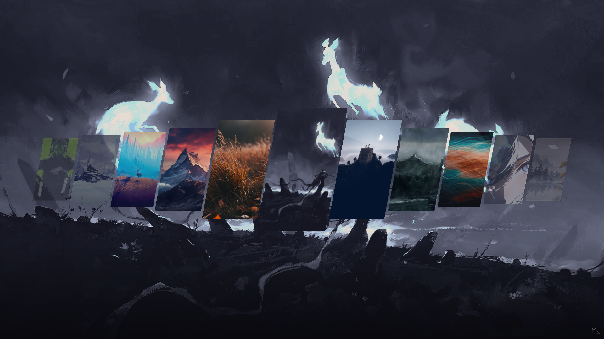
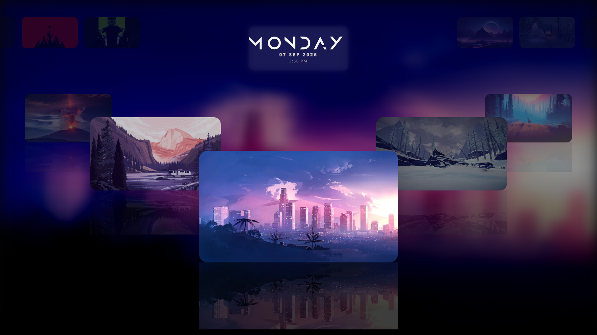
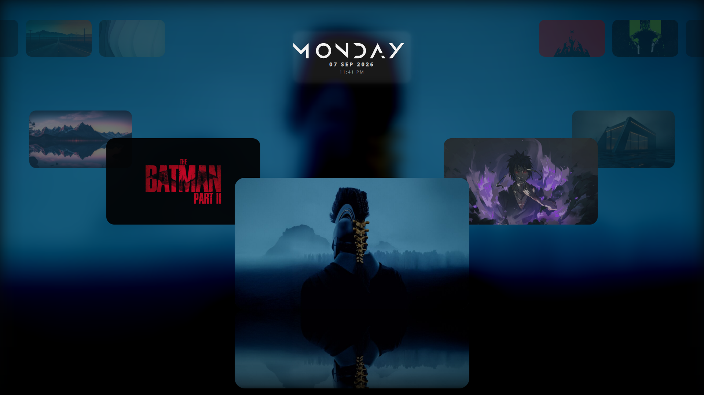
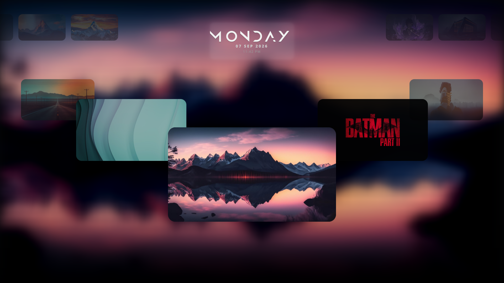
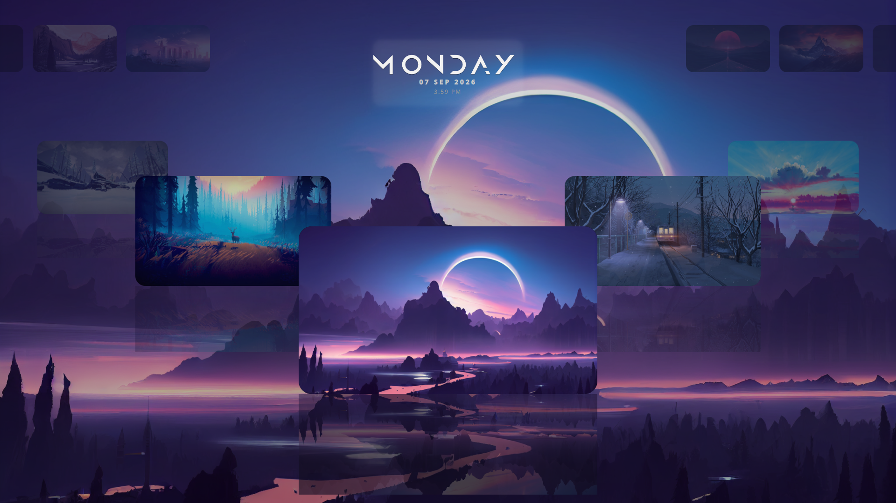
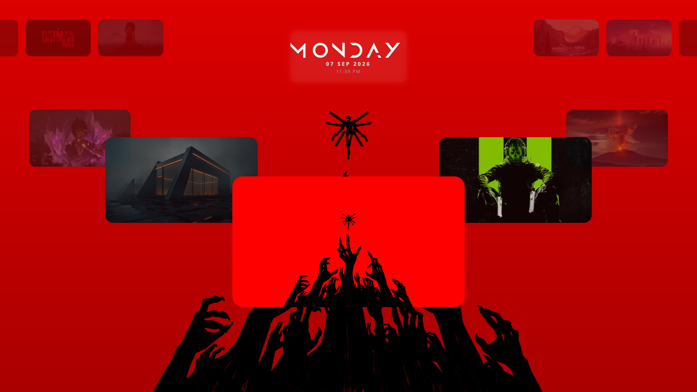
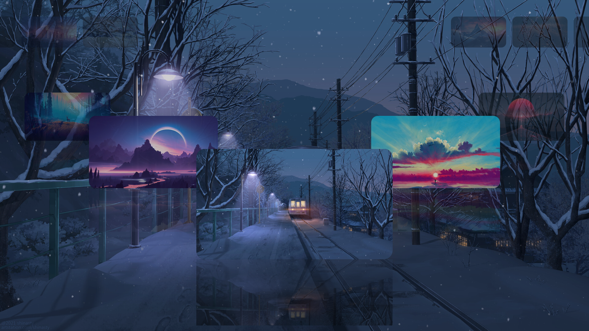
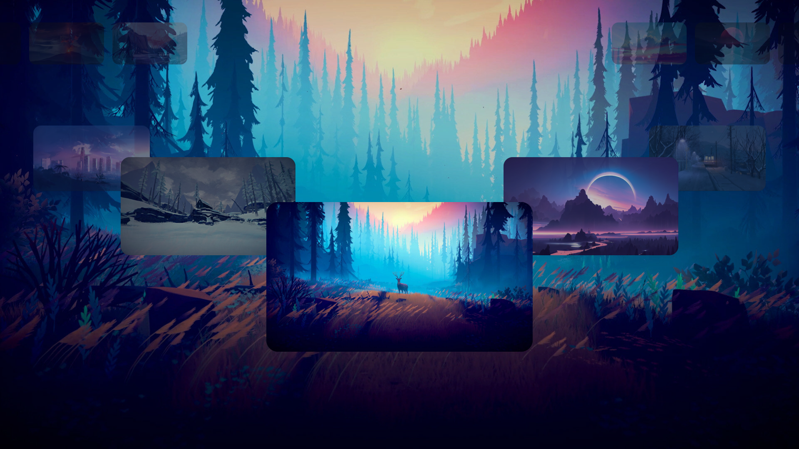
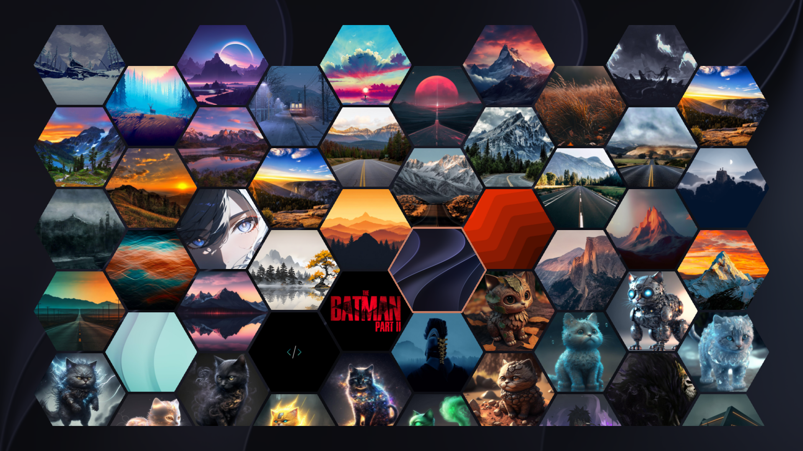
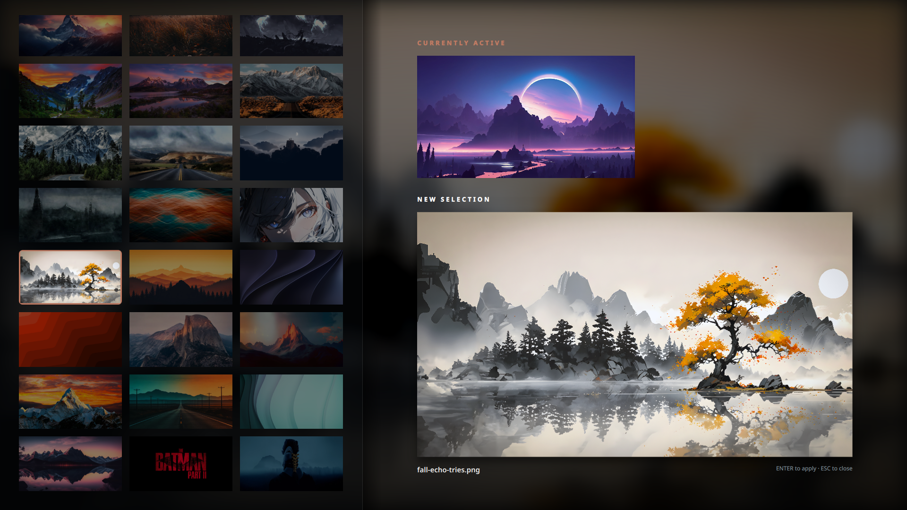

## 📸 Layouts

### Classic List *(default)*
A plain vertical/list layout — lightest on GPU, good for weaker hardware or minimal setups.

---

### Bottom Dock 
A sheared, parallelogram card deck along the bottom of the screen, uniform card height, with the focused card scaled up and outlined in your accent color.

---

### Coverflow Family
Cards fan out in 3D-style perspective around the focused item, classic "coverflow" browsing feel.

| Layout | Description | Screenshot |
|--------|-------------|------------|
| **Coverflow** | Classic 3D coverflow with background blur |  |
| **Coverflow Clear** | Coverflow without background blur — use this if your compositor/GPU can't keep blur smooth |  |
| **Coverflow Minimal** | Coverflow without on-screen widgets (clock/info) layered in |  |

---

### Floating Family

#### Floating (with widgets & reflections)
Features a tiered, 3D floating cloud effect with an ultra-smooth background blur and a glassmorphic Date & Time overlay in the top center.

| Layout | Description | Screenshot |
|--------|-------------|------------|
| **Floating** | Blurred background with glassmorphic date/time overlay, reflections on all cards |  |
| **Floating Center Reflection** | Blurred background with date/time, reflection only on center card |  |
| **Floating Clean** | Blurred background with date/time, no reflections |  |

#### Floating Clear (without blur, with widgets)
Replaces the heavily blurred background with the original high-resolution wallpaper in crisp detail, keeping the sleek Date & Time overlay on top.

| Layout | Description | Screenshot |
|--------|-------------|------------|
| **Floating Clear** | High-res wallpaper with date/time, reflections on all cards |  |
| **Floating Clear Clean** | High-res wallpaper with date/time, no reflections |  |

#### Floating Minimal (without blur, no widgets)
Offers a completely unobstructed view of your high-resolution wallpaper by removing the Date & Time overlay entirely, keeping focus purely on the 3D card deck.

| Layout | Description | Screenshot |
|--------|-------------|------------|
| **Floating Minimal** | High-res wallpaper, no date/time, reflections on all cards |  |
| **Floating Minimal Clean** | High-res wallpaper, no date/time, no reflections |  |

---

### Hexacomb
A honeycomb grid of hexagonal tiles, navigable in both directions (columns and rows) instead of a single strip. Idea for this layout taken from [Horizon0427/Arch-Config](https://github.com/Horizon0427/Arch-Config) — the hex-grid wallpaper picker there was the inspiration, rebuilt here from scratch for Quickshell/QML.

---
### Grid View
A two-pane grid browser — thumbnails on the left, a live "Currently Active" vs "New Selection" comparison on the right so you can preview before committing. Focused thumbnail gets an accent-color outline; filename and `ENTER`/`ESC` hints shown below the preview.

---

> Screenshots referenced above go under `assets/screenshots/` in this repo
